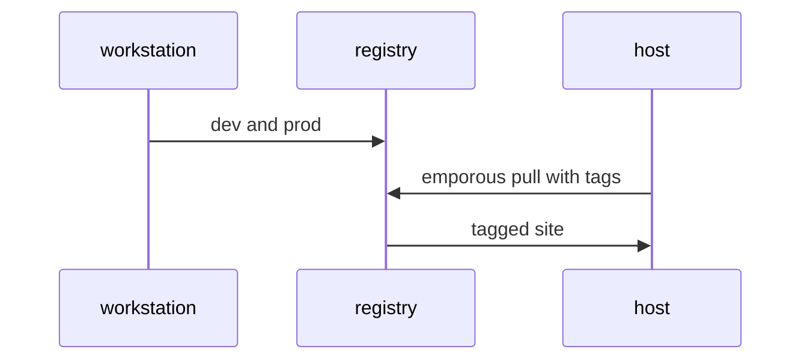
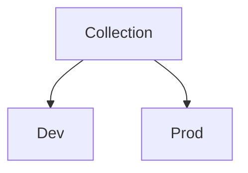

# Example use case structure

**Demo:**

## Use case description

Packing websites into containers is a common practice. However, sometimes you just want to make your site as light as possible. Especially in static site cases where you just need the content. Emporous allows you to store your site in a container registry and easily push/pull the site ready to serve. 

In this example we use Hugo, a static site generator along goexec to serve the http assets. 

## Flow

## Outline

## Demo resources
Emporous, hugo, and goexec
See [Installing Hugo](https://gohugo.io/getting-started/installing/) to install hugo 
Run `go install github.com/shurcooL/goexec@latest` to install goexec to serve the http server

## Demo instructions
1. Change the demo-content dev and prod site to your liking.
2. Run utils/prepare-and-push.sh to generate both sites and push to a registry
3. Run utils/pull-and-serve.sh to serve a version of a site

## What's next?
Try taking it a step further! Mix and match content. For example, one may wish to serve images from the dev site. Or go all out and create a A & B site! A common marketing strategy for sites to test user engagement. 
